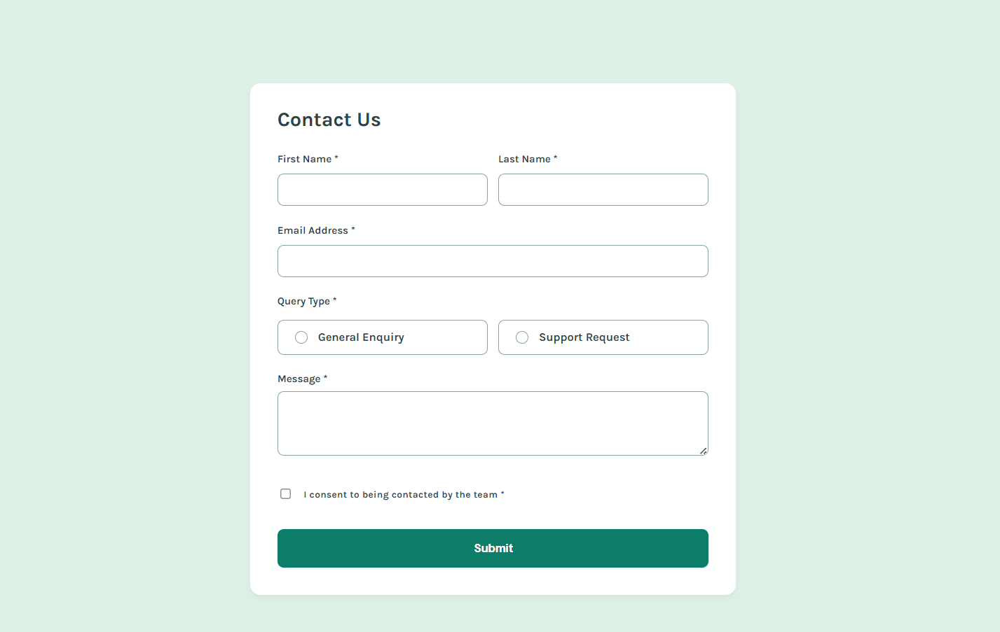

# Frontend Mentor - Contact Form Solution

This is a solution to the [Contact Form challenge on Frontend Mentor](https://www.frontendmentor.io/challenges/contact-form--G-hYlqKJj).  
Frontend Mentor challenges help improve coding skills by building realistic projects.

## Overview

### The challenge

Users should be able to:

- Complete the form and see a success toast message upon successful submission
- Receive form validation messages if:
  - A required field is missing
  - The email address is not formatted correctly
- Complete the form using only their keyboard
- Have inputs, error messages, and the success message announced by screen readers
- View the optimal layout depending on the device screen size
- See hover and focus states for all interactive elements

### Screenshot

### Links

- Live Site URL: https://tatiana-golub.github.io/contact-form/

## My process

### Built with

- CSS Grid
- React
- Accessibility best practices (ARIA)
- Jest & React Testing Library

### What I learned

While working on this project, I focused heavily on **accessibility**, **form validation**, and **testing React components**.

Key takeaways:

- How to build accessible forms using React components and ARIA attributes
- How to display validation errors in a user-friendly and screen-reader-friendly way
- How to test controlled inputs and form behavior using React Testing Library
